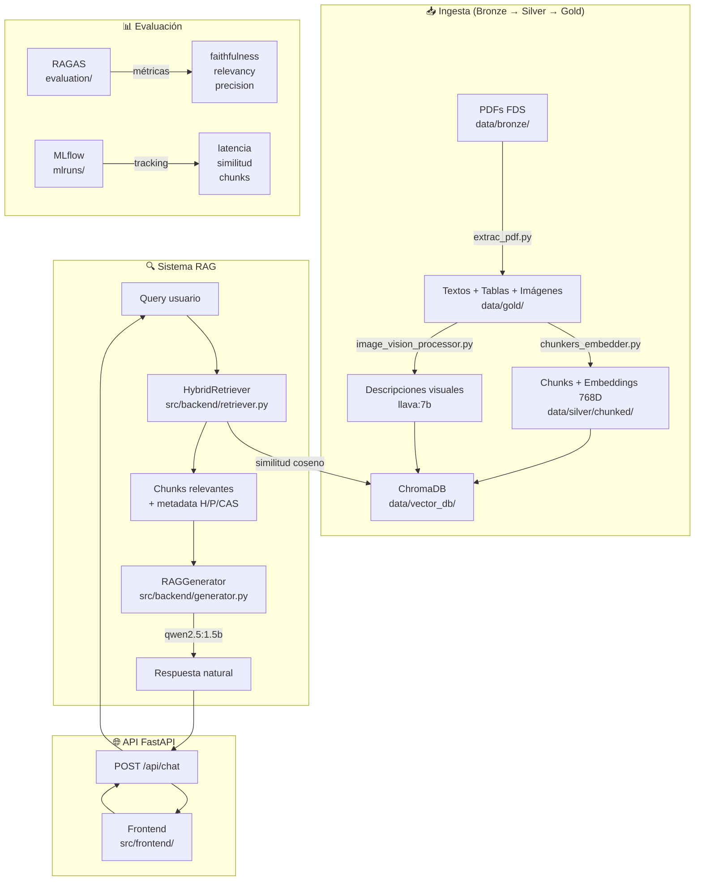
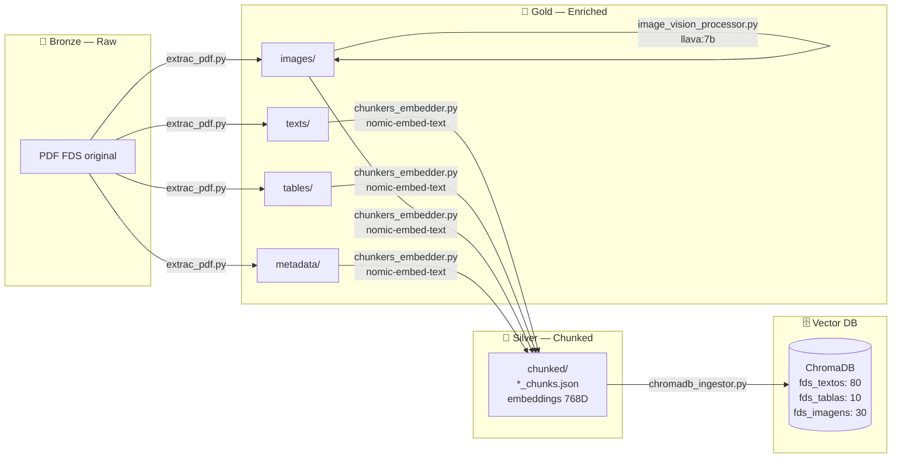
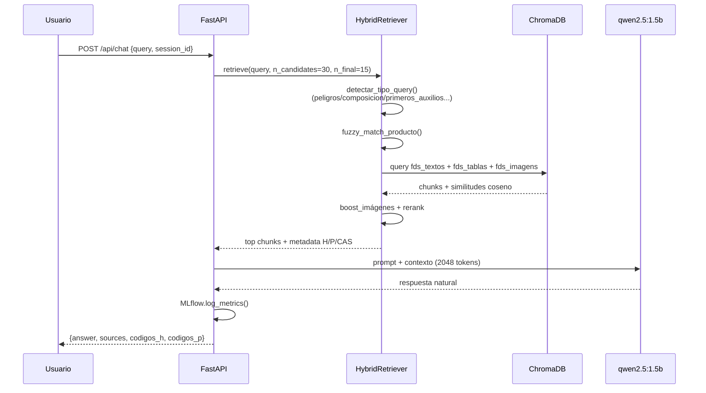
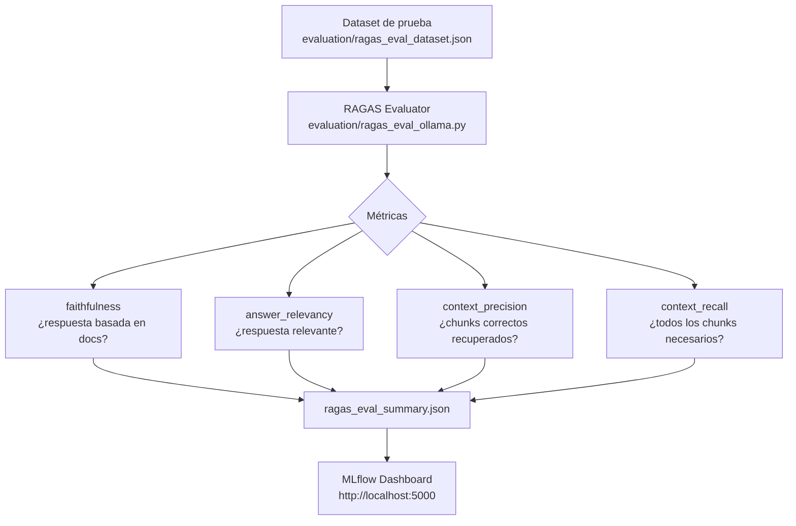

# RAG FDS — Sistema de Recuperación Aumentada para Fichas de Datos de Seguridad

Sistema RAG (**Retrieval-Augmented Generation**) para consultar Fichas de Datos de Seguridad (FDS) de productos químicos. Procesa PDFs, vectoriza su contenido en ChromaDB y expone una API conversacional con recuperación semántica híbrida y generación de lenguaje natural local mediante Ollama.

---

## Arquitectura General



---

## Pipeline de Procesamiento (Arquitectura Medallón)



---

## Flujo RAG: Retriever y Generator



---

## Evaluación con RAGAS



---

## Modelos Utilizados

| Modelo | Propósito | Dimensión | Comando |
|--------|-----------|-----------|---------|
| `nomic-embed-text` | Embeddings vectoriales (texto, tablas, imágenes) | 768D | `ollama pull nomic-embed-text` |
| `qwen2.5:1.5b` | Generación de respuestas — temp: 0.3, tokens: 500, ctx: 2048 | 1.5B params | `ollama pull qwen2.5:1.5b` |
| `llava:7b` | Descripción multimodal de imágenes (preprocesamiento offline) | 7B params | `ollama pull llava:7b` |

---

## Estadísticas del Dataset

| Colección ChromaDB | Chunks | Tipo de contenido |
|-------------------|--------|-------------------|
| `fds_textos` | 80 | Texto por secciones FDS |
| `fds_tablas` | 10 | Tablas convertidas a texto |
| `fds_imagens` | 30 | Descripciones visuales |
| **Total** | **120** | **5 documentos FDS** |

**Parámetros de chunking:**
- Tamaño máximo: 800 tokens por chunk (~3.200 caracteres)
- Overlap: 150 tokens entre chunks consecutivos
- Método: división por párrafos respetando límite de tokens
- Contexto: nombre del producto + sección prepended en cada chunk

---

## Estructura del Repositorio

```
RAG/
├── config.py                          # Configuración centralizada de rutas
├── requirements.txt
├── setupandrun.sh                     # Setup automático con Google Drive
│
├── data/
│   ├── bronze/                        # 🥉 PDFs originales
│   ├── silver/
│   │   └── chunked/                   # 🥈 Chunks + embeddings JSON
│   ├── gold/                          # 🥇 Contenido extraído
│   │   ├── texts/
│   │   ├── tables/
│   │   ├── images/
│   │   └── metadata/
│   └── vector_db/                     # ChromaDB (chroma.sqlite3)
│
├── evaluation/
│   ├── ragas_eval_dataset.json        # Dataset de preguntas/respuestas
│   ├── ragas_eval_ollama.py           # Evaluación con modelos locales
│   └── ragas_eval_summary.json        # Resultados de métricas
│
├── scripts/
│   ├── analyze_db.py
│   ├── chunkers_embedder.py
│   └── cleanup_chromadb.py
│
├── src/
│   ├── api/
│   │   └── main.py                    # API FastAPI
│   ├── backend/
│   │   ├── generator.py               # RAGGenerator
│   │   ├── retriever.py               # HybridRetriever
│   │   └── vectorstore.py             # Wrapper ChromaDB
│   ├── frontend/
│   │   └── index.html                 # Interfaz web
│   └── ingest/
│       ├── chromadb_diagnostic.py
│       ├── chromadb_ingestor.py
│       ├── extrac_pdf.py
│       └── image_vision_procesor.py
│
└── mlruns/                            # Tracking MLflow
```

---

## Configuración y Ejecución

```bash
# Prerequisitos
brew install ollama && ollama serve
ollama pull nomic-embed-text && ollama pull qwen2.5:1.5b

# Instalación
git clone https://github.com/so-fivs/RAG.git && cd RAG
python -m venv venv && source venv/bin/activate
pip install -r requirements.txt

# Pipeline de procesamiento (una vez por lote de PDFs)
python src/ingest/extrac_pdf.py
python src/ingest/chunkers_embedder.py
python src/ingest/image_vision_procesor.py   # requiere llava:7b
python src/ingest/chromadb_ingestor.py
python src/ingest/chromadb_diagnostic.py     # verificar ingesta

# Levantar API
cd src/api && python main.py               # http://127.0.0.1:8000

# Ver métricas MLflow
mlflow ui --backend-store-uri file:./mlruns  # http://127.0.0.1:5000

# Evaluación RAGAS
python evaluation/ragas_eval_ollama.py
```

---

## Endpoints de la API

| Método | Ruta | Descripción |
|--------|------|-------------|
| `POST` | `/api/chat` | Consulta RAG con sesión conversacional |
| `GET` | `/api/pictograma/{filename}` | Sirve imágenes GHS |
| `GET` | `/api/download_pdf/{nombre_o_codigo}` | Descarga PDF original |
| `POST` | `/api/reset_context/{session_id}` | Reinicia contexto conversacional |
| `GET` | `/health` | Estado del sistema |
| `GET` | `/` | Interfaz web |

---

## Ramas del Repositorio

| Rama | Descripción |
|------|-------------|
| `main` | Sistema base estable. Pipeline completo + API funcional |
| `experimento-1` | Prototipo inicial. 3 colecciones ChromaDB y chunking básico |
| `experimento-2` | Metadata enriquecida: códigos H/P y CAS |
| `experimento-3` | Retriever híbrido con fuzzy matching y detección de tipo de query |
| `experimento-4` | Integración llava:7b para descripciones semánticas de imágenes |
| `apifinal` | API FastAPI completa: sesiones, MLflow, endpoints de descarga |
| `apigoogledrive` | Integración Google Drive para ingesta automática (en desarrollo) |

---

## Notas Técnicas

- ChromaDB usa similitud coseno (`hnsw:space: cosine`). No soporta `$contains` — los filtros por producto se realizan en memoria.
- Los metadatos de códigos H/P se almacenan como strings serializados en ChromaDB y se parsean en tiempo de consulta.
- El contexto conversacional vive en memoria por sesión y se pierde al reiniciar el servidor.
- La latencia con `qwen2.5:1.5b` en CPU es de 30–240 segundos por consulta.
- Parche aplicado en `local_persistent_hnsw.py` para compatibilidad de `hnswlib==0.8.0` en macOS (`file_handle_count` + `persistence_location`).


