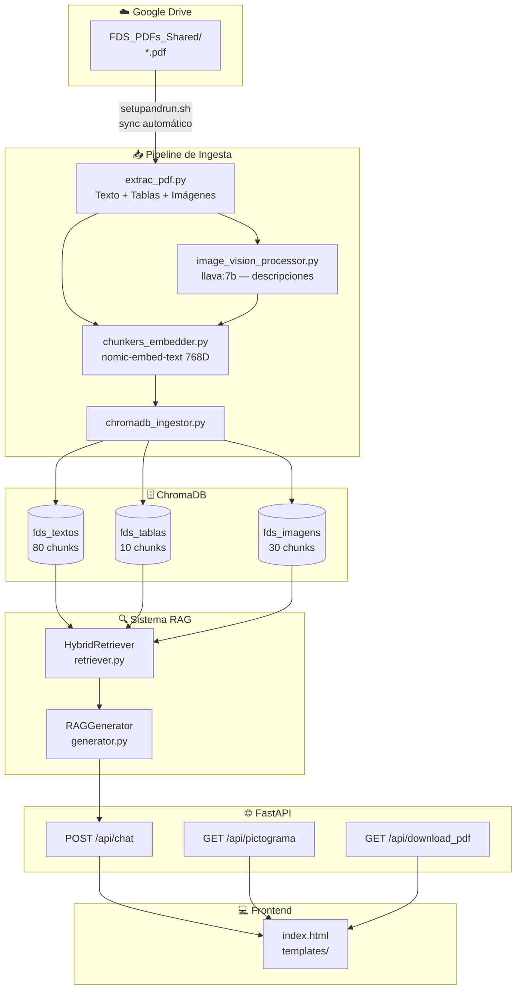
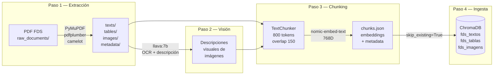
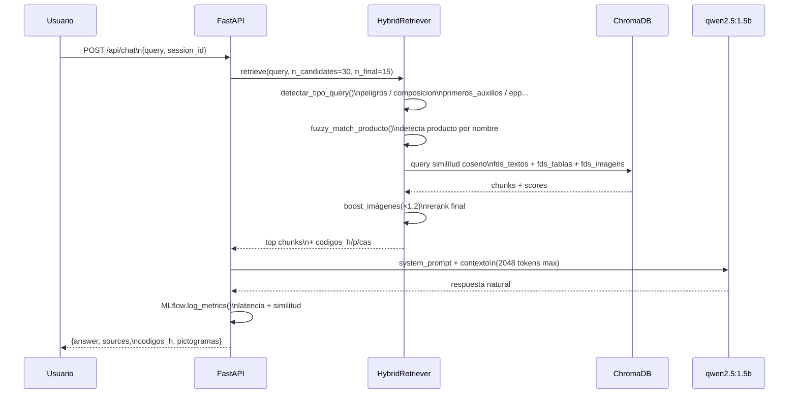
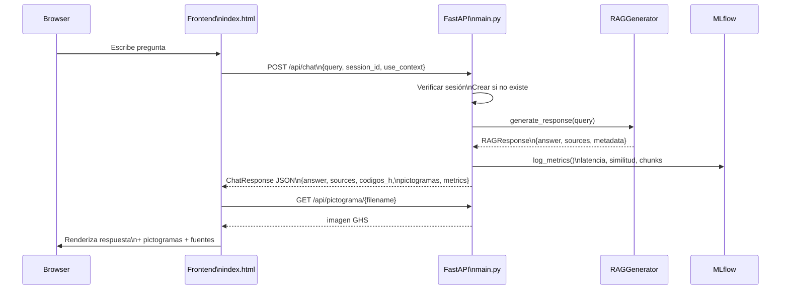
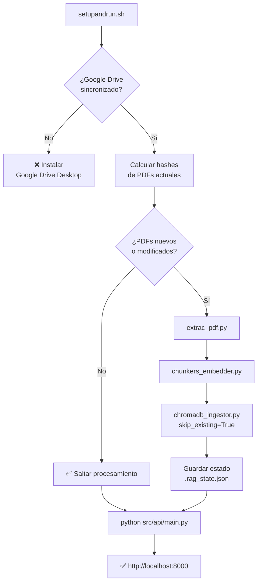

# RAG FDS — Sistema de Recuperación Aumentada para Fichas de Datos de Seguridad

Sistema RAG (Retrieval-Augmented Generation) para consultar Fichas de Datos de Seguridad (FDS) de productos químicos. Procesa PDFs, vectoriza su contenido en ChromaDB y expone una API conversacional con recuperación semántica híbrida y generación de lenguaje natural local mediante Ollama.

---

## Arquitectura General



---

## Pipeline de Procesamiento



---

## Sistema RAG: Retriever y Generator



---

## API FastAPI — Secuencia de Comunicación



---

## Flujo Google Drive (esta rama)



---

## Modelos Utilizados

| Modelo | Propósito | Dimensión | Comando |
|--------|-----------|-----------|---------|
| `nomic-embed-text` | Embeddings vectoriales para texto, tablas e imágenes | 768D | `ollama pull nomic-embed-text` |
| `qwen2.5:1.5b` | Generación de respuestas — `temperature: 0.3`, `num_predict: 500`, `num_ctx: 2048` | 1.5B params | `ollama pull qwen2.5:1.5b` |
| `llava:7b` | Descripción multimodal de imágenes (preprocesamiento offline) | 7B params | `ollama pull llava:7b` |

---

## Estadísticas del Dataset Actual

| Colección ChromaDB | Chunks | Tipo de contenido |
|--------------------|--------|-------------------|
| `fds_textos` | 80 | Texto por secciones FDS |
| `fds_tablas` | 10 | Tablas convertidas a texto |
| `fds_imagens` | 30 | Descripciones visuales de imágenes |
| **Total** | **120** | 5 documentos FDS procesados |

**Parámetros de chunking:**
- Tamaño máximo: 800 tokens por chunk (~3.200 caracteres)
- Overlap: 150 tokens entre chunks consecutivos
- Método: división por párrafos (`\n\n`) respetando límite de tokens
- Contexto prepended: nombre del producto + sección en cada chunk

---

## Estructura del Repositorio

```
RAG/
├── config.py                        # Configuración centralizada de rutas
├── requirements.txt
├── setupandrun.sh                   # Setup automático con Google Drive
│
├── data/
│   ├── extracted_content/
│   │   ├── texts/                   # Textos limpios .txt
│   │   ├── tables/                  # Tablas .csv
│   │   ├── images/                  # Imágenes .jpeg/.png
│   │   └── metadata/                # JSONs de metadata por documento
│   ├── processed_chunks/            # JSONs con chunks + embeddings
│   └── vector_db/                   # ChromaDB (chroma.sqlite3)
│
├── raw_documents/                   # PDFs originales de FDS (symlink → Google Drive)
│
├── src/
│   ├── api/main.py                  # API FastAPI
│   └── rag/
│       ├── retriever.py             # HybridRetriever
│       └── generator.py             # RAGGenerator
│
├── templates/index.html             # Frontend web
│
└── data/
    ├── extrac_pdf.py                # Extracción: texto, tablas, imágenes
    ├── chunkers_embedder.py         # Chunking + embeddings
    ├── image_vision_processor.py    # Descripción visual con llava:7b
    ├── chromadb_ingestor.py         # Ingesta en ChromaDB
    ├── chromadb_diagnostic.py       # Diagnóstico BD
    ├── analyze_db.py                # Análisis de secciones
    └── cleanup_chromadb.py          # Reset de ChromaDB
```

---

## Configuración y Ejecución

```bash
# Prerequisitos
brew install ollama && ollama serve
ollama pull nomic-embed-text && ollama pull qwen2.5:1.5b

# Instalación
git clone https://github.com/so-fivs/RAG.git && cd RAG
git checkout apigoogledrive
python -m venv venv && source venv/bin/activate
pip install -r requirements.txt

# Ejecución automática con Google Drive
chmod +x setupandrun.sh
./setupandrun.sh

# O ejecución manual
python data/extrac_pdf.py
python data/chunkers_embedder.py
python data/image_vision_processor.py   # requiere llava:7b
python data/chromadb_ingestor.py
python src/api/main.py                  # http://127.0.0.1:8000

# Ver métricas MLflow
mlflow ui --backend-store-uri file:./mlruns   # http://127.0.0.1:5000
```

---

## Endpoints de la API

| Método | Ruta | Descripción |
|--------|------|-------------|
| `POST` | `/api/chat` | Consulta RAG con gestión de sesión conversacional |
| `GET` | `/api/pictograma/{filename}` | Sirve imágenes GHS |
| `GET` | `/api/download_pdf/{nombre_o_codigo}` | Descarga PDF original de la FDS |
| `POST` | `/api/reset_context/{session_id}` | Reinicia contexto conversacional |
| `GET` | `/health` | Estado del sistema y sesiones activas |
| `GET` | `/` | Interfaz web |

---

## Descripción por Ramas

| Rama | Descripción |
|------|-------------|
| `main` | Sistema base estable. Pipeline completo + API funcional |
| `experimento-1` | Prototipo inicial. 3 colecciones ChromaDB y chunking básico |
| `experimento-2` | Metadata enriquecida: códigos H/P y CAS |
| `experimento-3` | Retriever híbrido con fuzzy matching y detección de tipo de query |
| `experimento-4` | Integración `llava:7b` para descripciones semánticas de imágenes |
| `apifinal` | API FastAPI completa: sesiones, MLflow, endpoints de descarga |
| `apigoogledrive` | **Integración Google Drive** para ingesta automática *(rama actual)* |

---

## Notas Técnicas

- ChromaDB usa similitud **coseno** (`hnsw:space: cosine`). No soporta `$contains` — los filtros por producto se realizan en memoria.
- Los metadatos de códigos H/P se almacenan como strings serializados en ChromaDB y se parsean en tiempo de consulta.
- El contexto conversacional vive en memoria por sesión y se pierde al reiniciar el servidor.
- La latencia con `qwen2.5:1.5b` en CPU es de 30–240 segundos por consulta.
- `setupandrun.sh` detecta PDFs nuevos/modificados por hash MD5 y solo procesa los cambios.

> ⚠️ **Seguridad:** Mover la API key de Gemini de `config.py` a variable de entorno antes de hacer el repositorio público.

